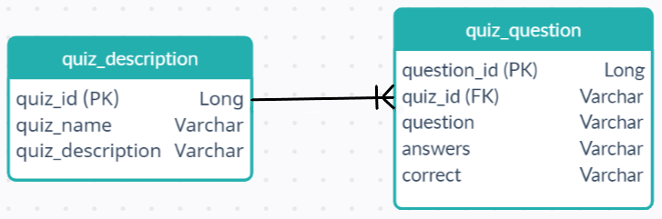
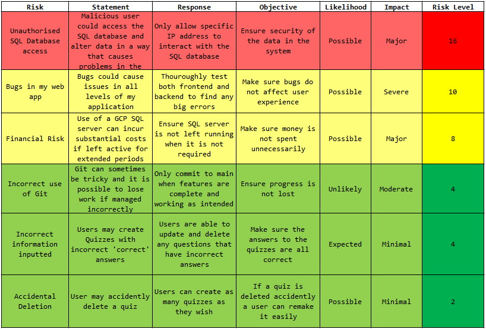
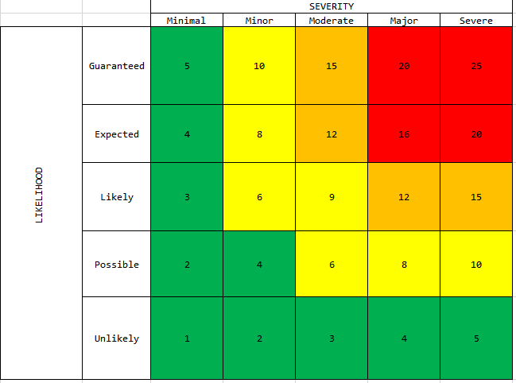
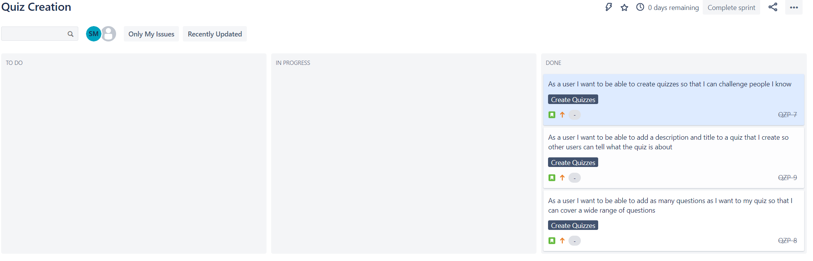
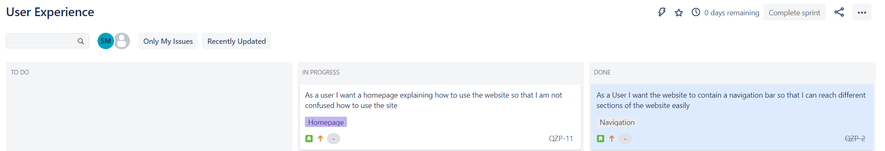
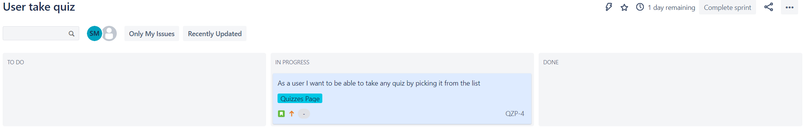
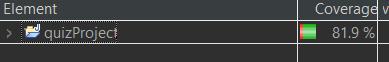
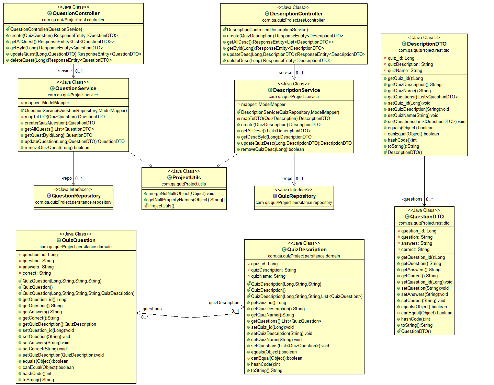

# Cloud Native - Fundamental Project

## Brief

The goal of this project is to create a CRUD application which utilizes tools, methodologies and technologies provided by the core modules covered in training _so far_.

## Requirements

I plan to meet the following requirements to ensure the success of my project:

* Jira board to display user stories, use cases and tasks that were completed
* A detailed Risk Assessment
* Clear documentation describing the architecture I will use for my project.
* A relational database used to persistently store data for my project.
* Functional application created in Java, following best industry practices and design principles.
* Functional front-end website and integrated API.
* Fully designed test suites - including automated tests for validation of the application.
* Ensure an acceptable level of test coverage in the back-end
* Fully integrated Version Control System.
* Utilizes GCP SQL Database

## My Approach
For this project I decided to create a quiz platform. Users are able to create quizzes and take all the quizzes that other users have created.

I used the Spring Framework to create the backend for my web application.

I created a series of automated Unit and Integration tests to ensure the code I have written works as intended. I used the JUnit and Mockito tools to help create these tests.

I used GCP to deploy an SQL database server which is used to store the quizzes that are inputted into the frontend of my CRUD application.

My frontend is written in HTML, JavaScript and CSS - while also making use of bootstrap to import useful elements into the webpage.

## ERD Diagrams
We were only required to use a single table for this project but I couldn't think of an efficient method to store each quiz and its questions in a single table that could be accessed easily.

My system uses an SQL database which contains two tables:
* quiz_descirption
* quiz_question

Below is a diagram displaying how these two tables are connected:

## Risk Assessment

### Risk Matrix

## Jira Board
I chose to split up the development of my project into a number of sprints, rather than having one or two large sprints. I have included a few of my sprints in the screenshots below:

### User Stories

These are the user stories I used to create my Jira board:
* As a User I want to be able to see a list of quizzes so that I can see all the quizzes I could do
* As a user I want to be able to take any quiz by picking it from the list
* As a user I want to receive a score after I complete a quiz so that I know how many answers were correct
* As a user I want to be able to create quizzes so that I can challenge people I know
* As a user I want to be able to add as many questions as I want to my quiz so that I can cover a wide range of questions
* As a user I want to be able to add a description and title to a quiz that I create so other users can tell what the quiz is about
* As an owner I want to be able to delete quizzes from the website so that I can remove any incorrect or inappropriate content
* As a user I want a homepage explaining how to use the website so that I am not confused how to use the site
* As a User I want the website to contain a navigation bar so that I can reach different sections of the website easily

## Development

### Java
I created the backend for my web application using the Java programming language with various plugins to aid in development and maintenance. My application will adhere to the various principles and standards we were introduced to during our training sessions thus far.

### Spring Framework
I used the spring framework to develop my Java backend as it simplifies the creation of projects by automating various configuration steps. This framework also handles a lot of procedures under the hood to allow for smoother development.

### HTML, CSS and JavaScript
My frontend is made using a combination of the above languages which all work in tandem to produce a sleek and responsive web application. This frontend application communicates with my backend using a variety of HTTP fetch requests and data is passed between the back and frontend using JSON statements.

### Git and GitHub
I am using Git as a version control system for the development of my web application. I will be using GitHub as a repository for my project. Git allows me to keep track of updates for my app and revert any changes that cause problems.

### GCP Server
I am using a GCP SQL Database server to store the quizzes for my application. GCP is useful because I am able to scale up the processing power of my database server if required.

## Testing
I used the below testing methodologies to achieve **81.9%** test coverage.

These tests can be replicated by loading my source code into Eclipse IDE, right-clicking on the 'quizProject' root file, selecting the 'Coverage As' drop down menu and then 'JUnit test'.

I carried out testing on all of the components that handle requests between the frontend(Controller), all the way through to the components that deal with the SQL server(Domain/Repository).

### Unit Testing - JUnit
I used JUnit to carry out unit testing on both service and controller layers of my application backend to ensure that all of my modules were working as intended and would not cause any major issues with the web application. A variety of annotations are used within JUnit to specify how each test is to be carried out and they pre-conditions that must be met before each test.

### Integration Testing - Mockito & JUnit
I used integration testing to ensure that all of my modules work as intended when used together in conjunction. Both of my service layers were tested with JUnit and I used Mockito to perform integration testing on my controllers.
Mockito essentially allows me to start up a 'mock' database to access with my controller tests to ensure the returned outputs are as expected.

## UML Diagram
Below is the UML diagram of my final backend application:

## Acknowledgements
* Aswene Sivaraj - For teaching me how to setup and query an SQL database and the basics of java
* Nicholas Johnson - For teaching me how to use Spring and set up the backend for this projects
* Reece Elder - For teaching me how to create a frontend website that can interact with my backend
* Naail Choudhury - For support throughout my training
